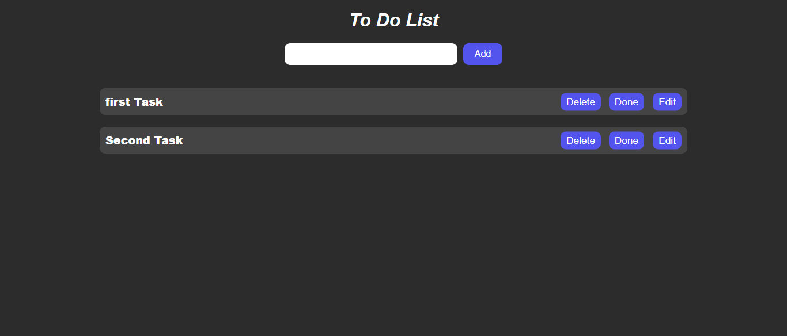

# To-Do List Project



This project is a simple To-Do List application designed to help users manage tasks efficiently. It is built using HTML, CSS, and JavaScript, with tasks stored persistently using the browser's LocalStorage.

---

## **Features**
- Add tasks to the list.
- Edit existing tasks.
- Delete tasks from the list.
- Tasks are stored and retrieved from LocalStorage, ensuring they remain available after page reloads.
- Simple and user-friendly interface.

---

## **Technologies Used**
- **HTML**: For structuring the web page.
- **CSS**: For styling the user interface.
- **JavaScript**: For implementing functionality and interacting with LocalStorage.

---

## **How to Use**
1. Open the `index.html` file in any modern web browser.
2. Use the input field to type in a task and click the "Add" button to add it to the list.
3. Use the "Edit" button to modify an existing task.
4. Use the "Delete" button to remove a task from the list.
5. Tasks are automatically saved in LocalStorage and will appear when the page is reloaded.

---

## **Folder Structure**
```
To-Do-List-Project/
|
|-- index.html
|-- style.css
|-- script.js
|-- README.md
```

---

## **Future Enhancements**
- Add a feature to mark tasks as completed.
- Implement a search bar to filter tasks.
- Allow users to set due dates for tasks.
- Improve the user interface with animations and advanced styling.

---

Feel free to explore and modify the project to suit your needs. Feedback and contributions are always welcome!
